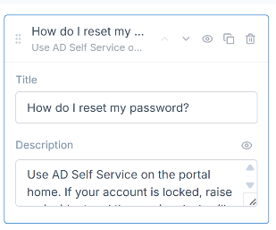
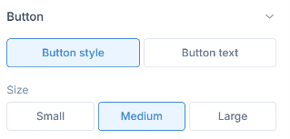
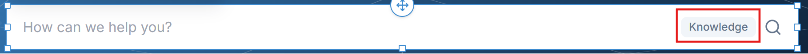
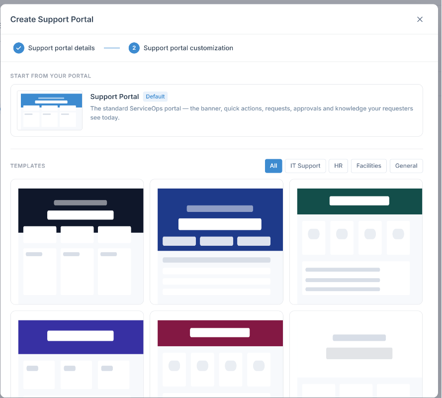
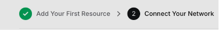
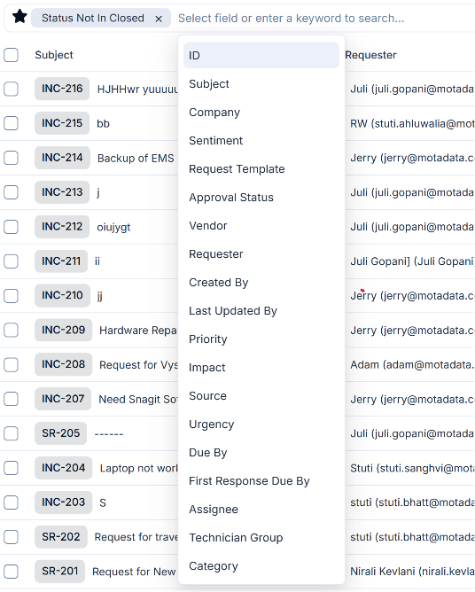
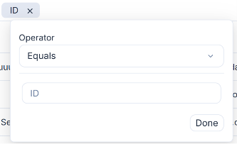
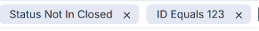

# Need to discuss with niravbhai

1.tour guide
2.AI capabilities
3.Video/GIF as a Widget
4.'Set as default' functionality from templates
5.2 stepper changes for 1.support portal details 2.support portal customization
6.Theme, settings, Branding..

# Need to discuss with Sahilbhai
1.KB for FAQs

# tasks 
1.remove 'card templates' from parent section of 'Quick Action'. keep 'card templates' in individual action cards.
2.remove Custom 'Action card' widget from the sidedrawer of widget. 
3.action card's section should give feasibility to add external link button in that section from the parent section(Quick action)'s sidebar.
4.  - see this attached images and remove this data from 'My open requests' predefined Section.
5.  - see this attached images and remove this section fields from 'pending approval' widget.
6.  ,AD Self Service- see this attached images and remove this section fields from 'Most read' widget.
7.  - see this attached images and remove this section fields from 'My Assets' widget.
8.  - see this attached images and remove this section fields from 'My CIs' widget.
9.  - see this attached images and remove this section fields from 'Announcements' widget.
10.  -  see this attached images and remove title,'Show hours' section and toggle for email and phone number fields. also remove email label and phone label fields we can's edit them, and give only email value and phone value as a editable input fields.
11. - see this image and you can see the count badge for this all 5 livedata widgets are given to the right side besides the view link field. so need to give the badges besides the Title of card as you can see in this image :  
12. - no need to give option to select the open requests list from the 'My open requests' card. so remove that selection and sidebar configuration for this listing section.
13. - remove this action card as a individual placement on page, it should only placed inside parent section of actions card. which is already placed. so need to remove clone functionality from floating toolbar of action cards and also need to disable the way to add action cards from widget sidebar as we were showing brfore.
14. - remove 'action' section from the sidebar of each 4(New Incident,Request Service,AD Self Service,Knowledge) action cards.
15.  - see this attached images and remove this section fields except 'show description' toggle from 'Most Used Services' widget.
16. - remove design section from 'logo' sidebar.
17. - see the image and remove 'shadow' field from navbar's sidebar.
18. - see the image as a reference and nee to give inline font style editor for each floating toolbar of Text fields.
19.  - see the image and remove 'Open in a new tab' this field from the button action. and see 2nd image and remove this 2 fields - 'a page in this portal' and 'Call a number' from Dropdown.
20.as we are removing the all content edition from right sidebar of each predefined widget's as - all 4 action cards(New Incident,Request Service,AD Self Service,Knowledge), My Open req. pending approval, My assets, My CIs, favrouite Services, Frequenty used services, Announcements,Most read (knowledge) widgets will not more inline editable for heading. only action cards will have acess to edit inline for it's description field placed inside card. for other all mentioned Predefined widgets are not more inline editable.
21. - see the image and remove all fields except search placeholder.
22.Now need to add 2 sections by showing max 4 cards inside it. 1.Favrouite Services , 2. Most used services. for reference i can give you old existing product's card UI design , you need to refine it ane make looks like our currnet component like(action cards UI). this is our current portal's UI :  , this image is fav. services and most used services list for now to add in page. as a dummy data.

23.In this prompt i am giving a new task to you which we haven't even think of it in this project's conversation so ask me anything if you have doubt about and don't make assumptions : Now let me give you context brfore design it. we are adding new section and giving split section icon to the right and left of the section. but what we want to achieve for all these Basic, Visual and Custom section's all widgets is -> i will drag and add any widget in an any new added empty section as row wise, as in the element should placed row wise even it can be a text,image,accordian,button,table,divider(it's hide component which need to brings back but ask me first once you reach this task), List(not added now but need to write this Listing widget in future task md file), media slider,advanced tab,spacer, and text with image will be written in future task md file(no need to implement them now). and we will make sure that user drag and drop or select element from widget section and add from add icon placed in middle, the element will by default placed on left so every elements can be placed accordingly.
-now hope you understands the usecase of adding elements row wise, no i can able to change the gap between the elements by giving gap field to sidebar for custom made section. also i can add divider between the elements in custom section. now i am adding 2 elements row wise for example let me give you context by giving example of how this functionality would works : i am placing image in 1st row with any default size of image. then i am adding a title in 2nd row and description in 3rd row. then now i wants image as a top-left column  and text and description with merging the rows and place it to the right column of image which will be invisible for user but we will give/provide a way to feel user on UI perspective that he can place or put that merged row in a column. now i want you to think that how should we solve this problem in a way that admin user can easily customize the section like this behaviour by just dragging elements row wise and splitting the row column wise but... inside the 1 section.
-> let me give another usecase for example i wants to add title and description then a table from widget , then i will simply add title which shows on topleft by default then same description will placed in new row and table will placed in new row. in this case there is no need of any requirement of more styling except gab bwetween 2 items.  
-i am thinking that for this complex thinking we can just simply split - the row into columns from the rows and which will have the same height any widget is placed. and if user deletes any column inside the section then anoither section rearrange it's position to left side with it's default height.
-> **FULL BRIEF: [SECTION-ROW-COLUMN-DRAG-PROMPT.md](SECTION-ROW-COLUMN-DRAG-PROMPT.md)** — the row/column model, the blue-line hit-zone rules, column sizing, delete/reflow, and the definition of done. Decisions taken 25 Aug 2026: no merge step (a column IS a stack), drop-on-edge creates the column, equal share until an element is stretched, Divider restored.

24.now let's come to the table widget - in table widget remove the whole configuration of table as per now and give it to edit table's data as Word is giving you can see that in attached image. 1st Word gives the column selection from the 10x10 rows and column, and after adding the data in column from the inline cell selection as you can see in image with inline text floating toolbar.        
-> so see all attached image and you will get idea how out table should looks like and how i can manage each row and colunmn, i can drag them smoothly, i can edit them from given floating toolbar action same as work is giving as attached image.insert and delete any row,column,table or cell.we will give cell wise inline edit for text instead of popup and all things. and max 10 by 10 rows column can be come. so there is no need of other styling inside the table. keep titel field from content section and spacing in style section. other given instructions like table row column selecting will show on popup on click of insert table field and  i should increase the cell padding by just stratcinh from the bottom. so only keep spacing section for table remove all other things, cause we are handling it from inline. 
-> you can use this file to build the whole experience of table UI wise - D:\Motadata\ServiceOps-Ticket-Detail--main\ServiceOps-Ticket-Detail--main\TABLE-ELEMENT-PROMPT.md

25.Action cards cannot be placed on their own, you removed action cards from the widgets which is not correct, bring back them but we need to show disabled state with added icon to right of the card for each predefined cards in live data and in action cards also. nothing will be removed from the widget sidebar.

26.Contact Us section still have the inline editable fields and not removed hours fields from the contact us card. please fix it.and empty section is also not removed from sidebar.

27.change the title as 'support portal customization' to 'support portal'.

28.in every widget's sidebar which has DESIGN section in it's sidebar, then it should make 1st accordian of DESIGn section as expanded and other will be collapsed.

29.Now come to each Basic,visual,custom section's widgets :  1. Accordian should remove the Content section which is Display Row. and in design section keep only Style and Spacing Accordins, other will be removed. when i open the accordian item's box which has Title  field and Description field as you can see in image, give add link CTA to left bottom :   2.when i click on banner section and click on CHoose CTA - it opens popup of banner, need to remove search and title ,desc. of each banner only show the image of banner in the popup. and banner height section will have only 4 predefined size instead of px wise height size.
 3.remove the 'also use behind the page' toggle from sidebar. 4.remove add divider toggle from nav's sidebar. 
 
30.add fav. and most used services section to the wisget sidebar. and favrouite service section will have note for admin : that this section will only show when req. add favroite services.  

31.action cards section is predefined section but there is still 1 thing we can add in that section which is external link. so when i click on parent section of action cards - it will give a card in sidebar to open external link on click of the card. we will give URL field for user to add external link which openes on click of card. and for this specific action card we will give right  to change tite , subtext and icon to be editable from sidebar. and other 4 cards will not allowed to edit title from inline and sidebar also.

32.In Button's sidebar  do this changes : remove share this page fields from dropdown of action section's field. and button text tab also. from Button section of design section.and remove size of button field from button style. 

33.remove knowledge tag fom searchbar. 

34.remove setting menu from right menubar.

35.I want 2 stepper UI more intuitive. 1st let's discuss how it works functionally : So 1st stepper details should be same once i go to 2nd stepper by saving 1st part details. then no need to show 'create from scratch' and 'use template' clickable cards, instead of that we will bydefault showing create from scratch option on top and remove default template from there, and we will include default template as a 1st square template with default tag we are showing in templates section in 2nd stepper. . ask me if anything. reference UI for Stepper UI design :  

36.need to add 'video' widget in visual section of widget sidebar. keep spacing and style component In it's design section. and content section will give empty container to select Video or Upload Link of video to add video. and it's added then it should give replace video CTA. 

37.Now we are giving live data widgets as predefined only, but i want to add 'Custom widget' for now i don't know the name but i can give you context of what this card will looks like and what are the functionalities of the card. 
-> i will add the widget from sidebar and place on the page anywhere then card will have dummy data for title with emoty state, the sidebar of this custom widget will contain the title, Module selection from dropdown and filter the data of module by giving filter field. and user can show any module's data by selecting module and filter comes based on what module we have selected. and user will have predefined filter list and also adding filter manually by writing key operator and value. and then card will fetch the data based on given filter and module. as you can see this attached image is request isting's filter :   
Ask me if you don't get this task.

38.Need to give suggested size's upload image in banner, logo and icon as per their default size to give idea to user about the size of image before uploading it. show in empty state of upload image container. 

39.need to make light dark toggle/switcher more prominent/ primary color having. and also give tab uinside the color picker and if i have select light theme color picker of primary,secondary and nuetral color's color picker will select by default light tab. and if i change the switcher to dark , then all color picker's tab will select dark in tab.

40.Now i want you to duplicate this page and do below changes to the template. and cutrrent template will be place same as 2nd template named - support portal - 2.

the changes i wants :
1) make this duplicate portal page as default.
2) I want cards in My assets and My CIs section in default page, the default page will have only attached image section's with same placement of each section. and keep all functionality same for each predefined section from nav,banner,sidebar menubar, search, heading, action cards, and all other cards, even if i place another cards by adding new sections below this predefined cards and their's functionality would work same as we have build in this whole project. 
3) let me attach the default page of support portal with it's data and sections. and you need to replicat ethe page with same layout and sections placement.
-in next step i will tell you for card Ui changes of Asset and CIs section. for now replicate same UI as per the attached image.

41.now need to rework on Task 23. you might not started work for this task, this is kind of a big task for you to implement. you need to think harder and make this task fully workable smoothly. 
->what we want to achieve for all these Basic, Visual and Custom section's all widgets is -> i will drag and add any widget in an any new added empty section as row wise, as in the element should placed row wise even it can be a text,image,accordian,button,table,any custom and visual widgets to the parent section's Sub section. Parent section is the most outer section of sub section which binds other subsections into it. all sub section which can be 1,2,3,4..8 column wise. and row wise also it can be added upto 8. i hope you know the concept of how row is added by 'add' icon of any sub section. ask me if you have confusion in this sub section addition inside parent section. 
->now,in each sub section we have added, we can add elements/widgets expcept predefined widgets - by dragging them from sidebar or by clicking on plus icon which you can see in middle of each section.when user tries to add new widget in subsection then we can ask for he wants to add column wise inside the section or row wise inside the section. whatever behaviour he chooses we will add widgets as per the selected behaviour, and if user will split the columns to add 2 elements/widgets side by side then we will add them by keeping the gap as they split left most and right most horizontally. if user add row wise then we will expands the height of section and we will add elements with equal gap. these both behaviour will be responsive in spacing wise by default. now the split user will do and then another column / row add inside the sub section will bind it as parent section's subsection inside the subsection. i hope you are getting my point and understand what i am trying to tell. 
->the manual split is one of the option but another split we can give user is manual split which is split which automatically happens by dragging the element from it's original place to anywhere user wants to place as you can see in this image, it has showing visually how the manual split happens manually.   
-> inshort all level of feasibility must be sub section's each widget would have, as if row is selected as a behaviour then we can split them into multiple column, and If col. is selected as a behaviour then we can split them into rows. Now as this is complex task you need to think 10x harder to solve this problem. and please before you define the solution then please tell me once you have define the solution for how can these solve for our portal customisation, and we will start working on it by code.

42.1 thing which should work properly is responsiveness of added layout section, as if i am adding text field in a section and it is taking only 1 line of that empty section and place to top like you can see in attached image. then you should do 1 thing which is currently you can see the text has 2 word sentence, you should keep the selected outline 's width same as text's size. this concept will be applied on every element / widget like text,button.. etc i can see currently these 2 small widgets are not following this. and other section will be resize automatically based on their sibling section has only this much height and width. it will be adjusted automatically by responsive itself. this will happenes when 1 is empty section and 1 is filled section are placed besides each other, now if i add an image in other empty column section then it should take it's default size for first time and again the height of that sub section's parent section would increase as per other section's height has increased, and the outer section of text field will also increase it's height , but the element will contain it's individual outline by filling to it's width and height., once i add more text and height should be increase till i write the text and width will be equally divide for both sections placed besides each other.

i hope you get this context and understand the logic behind the resize,rearrange and automatically responsive itself with proper resize of section. not like messed up things.

43.1.you can see left menubar is having content you can see in image as it shows in right-sidebar, i want same sidebar for navbar's action icon placed on right of nav. and the same concept navbar's action icons has to interchange the icons by drag brtween icons only, i want same concept for left menubar's icon also.
2.banner resize from stratch icon shows on selection of banner is not properly work, when i stratch or resize the banner the image it self should resize instead of it's section. as you can see in 2nd image only outlined section is increasing th height of banner which is not proper, instead of this it should resize the banner's image itself.
3.see 3rd image and i told you that predefined sections/widget's any thing is not editable, but view lable of link is editable by clicking it inline, please make it uneditable as whole card is.

44
.1.you can see left menubar is having content you can see in image as it shows in right-sidebar, i want same sidebar for navbar's action icon placed on right of nav. and the same concept navbar's action icons has to interchange the icons by drag brtween icons only, i want same concept for left menubar's icon also.
2.banner resize from stratch icon shows on selection of banner is not properly work, when i stratch or resize the banner the image it self should resize instead of it's section. as you can see in 2nd image only outlined section is increasing th height of banner which is not proper, instead of this it should resize the banner's image itself.
3.see 3rd image and i told you that predefined sections/widget's any thing is not editable, but view lable of link is editable by clicking it inline, please make it uneditable as whole card is.
4.see 4th image and remove the image tab from design section. keep only none and color from parent section and action card's style section. remove image tab from parent and child's style section of all 5 action card.
5.okay as we have gave light , dark tab in theme's color picker we need to give this for each style section's color picker popup. so find all sections where color popup is opening to give color on parent,sub,child all sections and give light dark tabs, so that user can apply and check the color in light and dark both sections.
6.remove card widget from the widget section.
7.remove 'compose an email' from dropdown of action section's 'opens' field.
8.in theme menu remove Custom section and need to add a 'Home page background' section instead of custom section, and Home page bg section will have color and image tab which will apply whole page's background color or whole page's background image.  and banner image will be removed when full page bg image will be uploaded by user. we will show the size of image also.